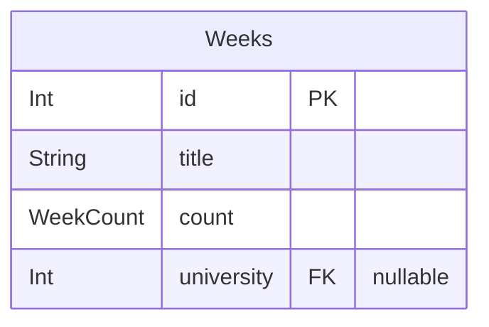
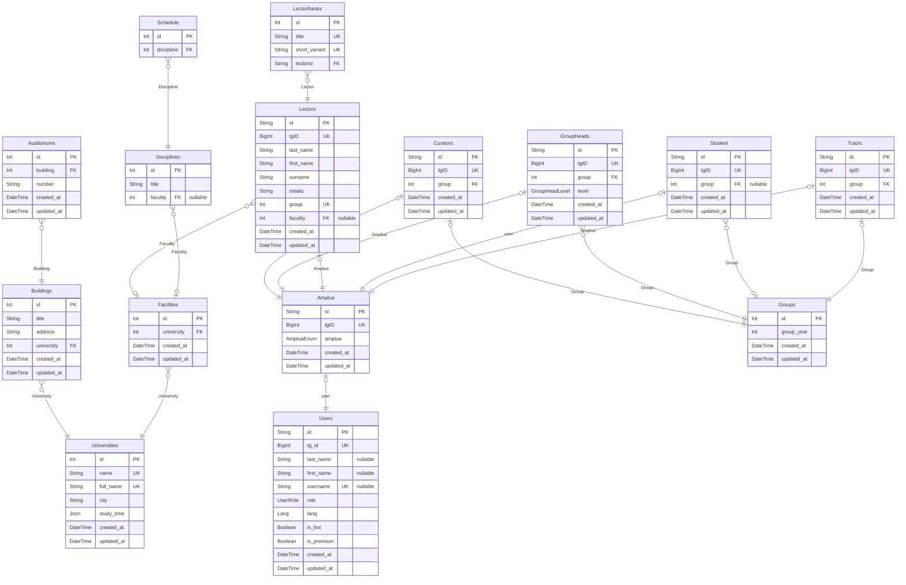

# Shopping Mall
> Generated by [`prisma-markdown`](https://github.com/samchon/prisma-markdown)

- [Actors](#actors)
- [Articles](#articles)
- [Orders](#orders)
- [default](#default)

## Actors

### `Weeks`
Both description and ERD on Actors chatper.

Also, only ERD on Articles and Orders chapters.

**Properties**
  - `id`: 
  - `title`
    > The tag "minItems 1" means mandatory relationship `||---|{`.
    > 
    > Otherwise, no tag means optional relationship `||---o{`.
  - `count`: 
  - `university`: 

## default

### `Amplua`

**Properties**
  - `id`: 
  - `tgID`: 
  - `amplua`: 
  - `created_at`: 
  - `updated_at`: 

### `Curators`

**Properties**
  - `id`: 
  - `tgID`: 
  - `group`: 
  - `created_at`: 
  - `updated_at`: 

### `GroupHeads`

**Properties**
  - `id`: 
  - `tgID`: 
  - `group`: 
  - `level`: 
  - `created_at`: 
  - `updated_at`: 

### `Lectors`

**Properties**
  - `id`: 
  - `tgID`: 
  - `last_name`: 
  - `first_name`: 
  - `surname`: 
  - `initials`: 
  - `group`: 
  - `faculity`: 
  - `created_at`: 
  - `updated_at`: 

### `LectorRanks`

**Properties**
  - `id`: 
  - `title`: 
  - `short_variant`: 
  - `lectorId`: 

### `Student`

**Properties**
  - `id`: 
  - `tgID`: 
  - `group`: 
  - `created_at`: 
  - `updated_at`: 

### `Tutors`

**Properties**
  - `id`: 
  - `tgID`: 
  - `group`: 
  - `created_at`: 
  - `updated_at`: 

### `Schedule`

**Properties**
  - `id`: 
  - `discipline`: 

### `Auditoriums`

**Properties**
  - `id`: 
  - `building`: 
  - `number`: 
  - `created_at`: 
  - `updated_at`: 

### `Buildings`

**Properties**
  - `id`: 
  - `title`: 
  - `address`: 
  - `university`: 
  - `created_at`: 
  - `updated_at`: 

### `Disciplines`

**Properties**
  - `id`: 
  - `title`: 
  - `faculity`: 

### `Facilities`

**Properties**
  - `id`: 
  - `university`: 
  - `created_at`: 
  - `updated_at`: 

### `Groups`

**Properties**
  - `id`: 
  - `group_year`: 
  - `created_at`: 
  - `updated_at`: 

### `Universities`

**Properties**
  - `id`: 
  - `name`: 
  - `full_name`: 
  - `city`: 
  - `study_time`: 
  - `created_at`: 
  - `updated_at`: 

### `Users`

**Properties**
  - `id`: 
  - `tg_id`: 
  - `last_name`: 
  - `first_name`: 
  - `username`: 
  - `role`: 
  - `lang`: 
  - `is_bot`: 
  - `is_premium`: 
  - `created_at`: 
  - `updated_at`: 