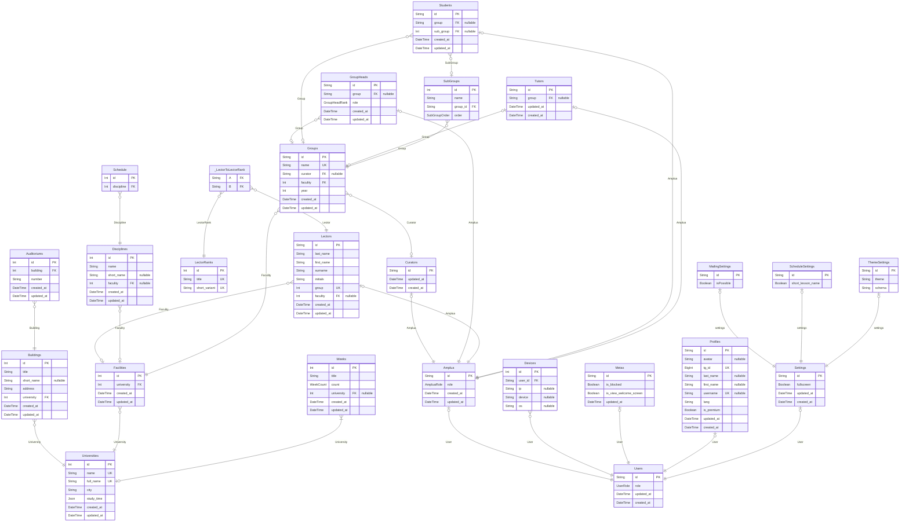

# Thodle Bot
> Generated by [`prisma-markdown`](https://github.com/samchon/prisma-markdown)

- [default](#default)

## default

### `Amplua`

**Properties**
  - `id`: 
  - `role`: 
  - `created_at`: 
  - `updated_at`: 

### `Curators`

**Properties**
  - `id`: 
  - `updated_at`: 
  - `created_at`: 

### `GroupHeads`

**Properties**
  - `id`: 
  - `group`: 
  - `role`: 
  - `created_at`: 
  - `updated_at`: 

### `Lectors`

**Properties**
  - `id`: 
  - `last_name`: 
  - `first_name`: 
  - `surname`: 
  - `initials`: 
  - `group`: 
  - `faculity`: 
  - `created_at`: 
  - `updated_at`: 

### `LectorRanks`

**Properties**
  - `id`: 
  - `title`: 
  - `short_variant`: 

### `Students`

**Properties**
  - `id`: 
  - `group`: 
  - `sub_group`: 
  - `created_at`: 
  - `updated_at`: 

### `Tutors`

**Properties**
  - `id`: 
  - `group`: 
  - `updated_at`: 
  - `created_at`: 

### `Schedule`

**Properties**
  - `id`: 
  - `discipline`: 

### `Auditoriums`

**Properties**
  - `id`: ID университета в базе данных
  - `building`: ID корпуса
  - `number`: Номер аудитории в строковом формате(302, 302a)
  - `created_at`: Дата создания пользователя в нашей системе
  - `updated_at`: Дата обновления пользователя в нашей системе

### `Buildings`

**Properties**
  - `id`: ID университета в базе данных
  - `title`: Название корпуса
  - `short_name`: Внегласное название корпуса
  - `address`: Адрес(улица) на котором находится корпус
  - `university`: ID университета, к которому корпус привязан
  - `created_at`: Дата создания пользователя в нашей системе
  - `updated_at`: Дата обновления пользователя в нашей системе

### `Disciplines`

**Properties**
  - `id`: ID дисциплины в базе данных
  - `name`: Название дисциплины
  - `short_name`: 
  - `faculity`: ID факультета
  - `created_at`: Дата создания пользователя в нашей системе
  - `updated_at`: Дата обновления пользователя в нашей системе

### `Facilities`

**Properties**
  - `id`: ID университета в базе данных
  - `university`: ID университета
  - `created_at`: Дата создания пользователя в нашей системе
  - `updated_at`: Дата обновления пользователя в нашей системе

### `Groups`

**Properties**
  - `id`: ID группы в университете
  - `name`: 
  - `curator`: 
  - `faculity`: 
  - `year`: 
  - `created_at`: Дата создания пользователя в нашей системе
  - `updated_at`: Дата обновления пользователя в нашей системе

### `SubGroups`

**Properties**
  - `id`: 
  - `name`: 
  - `group_id`: 
  - `order`: 

### `Universities`

**Properties**
  - `id`: ID университета в базе данных
  - `name`: Название университета в сокращенном варианте
  - `full_name`: Название университета
  - `city`: Город, где университет находится
  - `study_time`: Массив, где хранятся время когда проходят учебные процессы
  - `created_at`: Дата создания пользователя в нашей системе
  - `updated_at`: Дата обновления пользователя в нашей системе

### `Weeks`

**Properties**
  - `id`: ID недели в университете
  - `title`: Название недели в кокретном университете
  - `count`: Порядок недели
  - `university`: ID университета
  - `created_at`: Дата создания пользователя в нашей системе
  - `updated_at`: Дата обновления пользователя в нашей системе

### `Devices`

**Properties**
  - `id`: 
  - `user_id`: 
  - `ip`: 
  - `device`: 
  - `os`: 

### `Metas`

**Properties**
  - `id`: 
  - `is_blocked`: 
  - `is_view_welcome_screen`: 
  - `updated_at`: 

### `Profiles`

**Properties**
  - `id`: 
  - `avatar`: Аватар пользователя
  - `tg_id`: ID пользователя в телеграм
  - `last_name`: Фамилия пользователя в телеграм
  - `first_name`: Имя пользователя в телеграм
  - `username`: Имя пользователя пользователя в телеграм
  - `lang`: Выбраный им язык
  - `is_premium`: Является ли пользователь премиум пользователем
  - `updated_at`: Дата обновления профиля пользователя в нашей системе
  - `created_at`: Дата создания профиля пользователя в нашей системе

### `Settings`

**Properties**
  - `id`: 
  - `fullscreen`: 
  - `updated_at`: 
  - `created_at`: 

### `MailingSettings`

**Properties**
  - `id`: 
  - `isPossible`: 

### `ScheduleSettings`

**Properties**
  - `id`: 
  - `short_lesson_name`: 

### `ThemeSettings`

**Properties**
  - `id`: 
  - `theme`: 
  - `schema`: 

### `Users`

**Properties**
  - `id`: ID пользователя в базе данных
  - `role`: Роль пользователя в системе
  - `updated_at`: Дата обновления пользователя в нашей системе
  - `created_at`: Дата создания пользователя в нашей системе

### `_LectorToLectorRank`
Pair relationship table between [Lectors](#Lectors) and [LectorRanks](#LectorRanks)

**Properties**
  - `A`: 
  - `B`: 