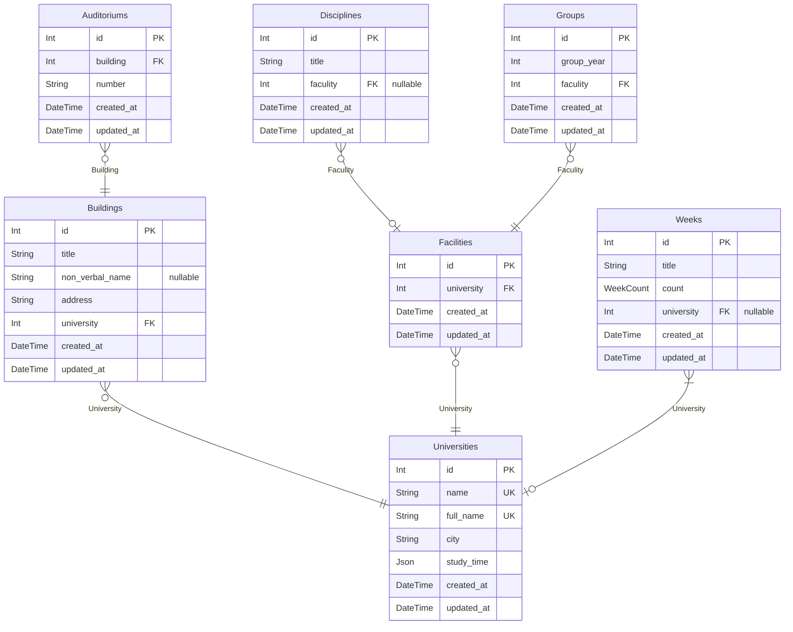
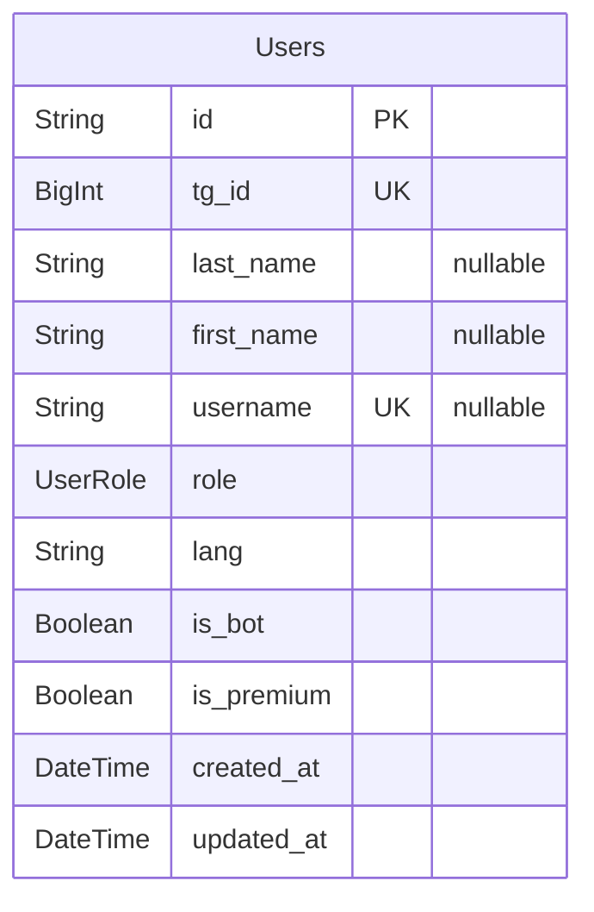
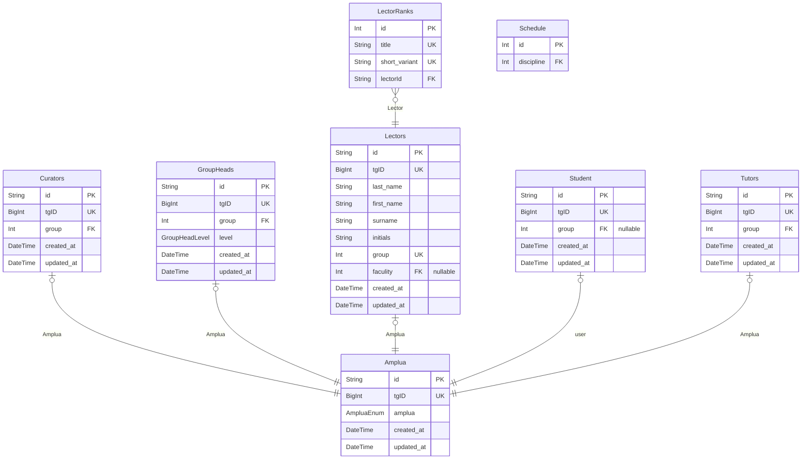

# Thodle Bot
> Generated by [`prisma-markdown`](https://github.com/samchon/prisma-markdown)

- [СтруктураУниверситета](#структурауниверситета)
- [Пользователь](#пользователь)
- [default](#default)

## СтруктураУниверситета

### `Auditoriums`
Модель **Аудитории**

Описание, всех аудиторий университета. Конкретно в данном случае, аудитории прикреплены к корпусам

**Properties**
  - `id`: ID университета в базе данных
  - `building`: ID корпуса
  - `number`: Номер аудитории в строковом формате(302, 302a)
  - `created_at`: Дата создания пользователя в нашей системе
  - `updated_at`: Дата обновления пользователя в нашей системе

### `Buildings`
Модель **Корпуса**

Описание корпусов университета, для упрощения навигации студентов в основном приложение

**Properties**
  - `id`: ID университета в базе данных
  - `title`: Название корпуса
  - `non_verbal_name`: Внегласное название корпуса
  - `address`: Адрес(улица) на котором находится корпус
  - `university`: ID университета, к которому корпус привязан
  - `created_at`: Дата создания пользователя в нашей системе
  - `updated_at`: Дата обновления пользователя в нашей системе

### `Disciplines`
Модель **Дисциплина**

Описание, всех дисциплин университета. Конкретно в данном случае, дисциплины прикреплены к факультетам

**Properties**
  - `id`: ID дисциплины в базе данных
  - `title`: Название дисциплины
  - `faculity`: ID факультета
  - `created_at`: Дата создания пользователя в нашей системе
  - `updated_at`: Дата обновления пользователя в нашей системе

### `Facilities`
Модель **Факультет**

Описание, всех факультетов университета. Конкретно в данном случае, факультеты прикреплены к университету

**Properties**
  - `id`: ID университета в базе данных
  - `university`: ID университета
  - `created_at`: Дата создания пользователя в нашей системе
  - `updated_at`: Дата обновления пользователя в нашей системе

### `Weeks`
Модель **Неделя**

Описание, названий недель университета. Конкретно в данном случае, это поможет в правильном структурировании расписаний в приложении,
а также, позволяет реализовать поддержку именования недель в конкретном университете.

Например: "Первая и Вторая", "Красная и Чёрная"

**Properties**
  - `id`: ID недели в университете
  - `title`: Название недели в кокретном университете
  - `count`: Порядок недели
  - `university`: ID университета
  - `created_at`: Дата создания пользователя в нашей системе
  - `updated_at`: Дата обновления пользователя в нашей системе

### `Groups`
Модель **Неделя**

Описание, названий недель университета. Конкретно в данном случае, это поможет в правильном структурировании расписаний в приложении,
а также, позволяет реализовать поддержку именования недель в конкретном университете.

Например: "Первая и Вторая", "Красная и Чёрная"

**Properties**
  - `id`: ID группы в университете
  - `group_year`: 
  - `faculity`: 
  - `created_at`: Дата создания пользователя в нашей системе
  - `updated_at`: Дата обновления пользователя в нашей системе

### `Universities`
Модель **Университета**

Точка входа для описания структуры университета. Тут содержатся основные его данные, для нормальной работы всего приложения

**Properties**
  - `id`: ID университета в базе данных
  - `name`: Название университета в сокращенном варианте
  - `full_name`: Название университета
  - `city`: Город, где университет находится
  - `study_time`: Массив, где хранятся время когда проходят учебные процессы
  - `created_at`: Дата создания пользователя в нашей системе
  - `updated_at`: Дата обновления пользователя в нашей системе

## Пользователь

### `Users`
Модель **пользователя**

Является основной моделью в базе данных, от которого мы наследуемся при работе с расписаниями

**Properties**
  - `id`: ID пользователя в базе данных
  - `tg_id`: ID пользователя в телеграм
  - `last_name`: Фамилия пользователя в телеграм
  - `first_name`: Имя пользователя в телеграм
  - `username`: Имя пользователя пользователя в телеграм
  - `role`: Роль пользователя в системе
  - `lang`: Выбраный им язык
  - `is_bot`: Является ли пользователь ботом
  - `is_premium`: Является ли пользователь премиум пользователем
  - `created_at`: Дата создания пользователя в нашей системе
  - `updated_at`: Дата обновления пользователя в нашей системе

## default

### `Amplua`

**Properties**
  - `id`: 
  - `tgID`: 
  - `amplua`: 
  - `created_at`: 
  - `updated_at`: 

### `Curators`

**Properties**
  - `id`: 
  - `tgID`: 
  - `group`: 
  - `created_at`: 
  - `updated_at`: 

### `GroupHeads`

**Properties**
  - `id`: 
  - `tgID`: 
  - `group`: 
  - `level`: 
  - `created_at`: 
  - `updated_at`: 

### `Lectors`

**Properties**
  - `id`: 
  - `tgID`: 
  - `last_name`: 
  - `first_name`: 
  - `surname`: 
  - `initials`: 
  - `group`: 
  - `faculity`: 
  - `created_at`: 
  - `updated_at`: 

### `LectorRanks`

**Properties**
  - `id`: 
  - `title`: 
  - `short_variant`: 
  - `lectorId`: 

### `Student`

**Properties**
  - `id`: 
  - `tgID`: 
  - `group`: 
  - `created_at`: 
  - `updated_at`: 

### `Tutors`

**Properties**
  - `id`: 
  - `tgID`: 
  - `group`: 
  - `created_at`: 
  - `updated_at`: 

### `Schedule`

**Properties**
  - `id`: 
  - `discipline`: 