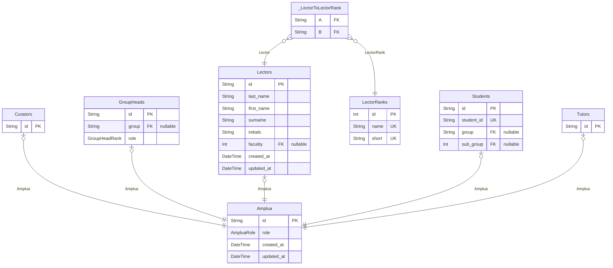
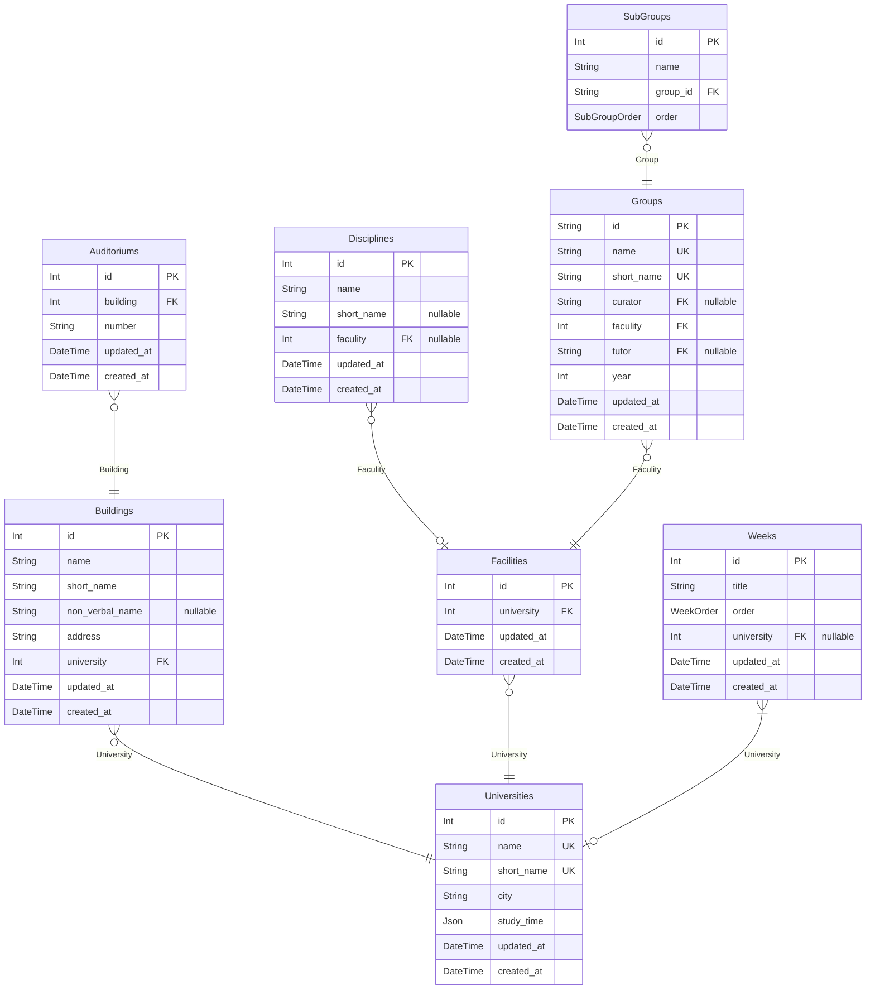
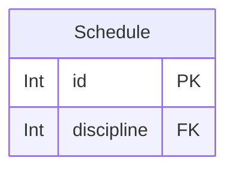

# Thodle Database Schema
> Generated by [`prisma-markdown`](https://github.com/samchon/prisma-markdown)

- [Amplua](#amplua)
- [University](#university)
- [User](#user)
- [default](#default)

## Amplua

### `Amplua`
-------------------------------------------------------
Схема "Амплуа"
-------------------------------------------------------

Модель **Амплуа**

Является точкой входа пользователя в качестве сущности в университете.
Он ссылается на другие модели, но так же, хранит в себе роли пользователя в рамках учреждения

**Properties**
  - `id`: Уникальный идентификатор пользователя
  - `role`
    > Роли пользователя в рамках учреждения
    > 
    > Варианты | Значения
    > -------|--------
    > **UNDEFINED** | Неизвестен. Установлен по умолчанию, поскольку есть вероятность, что человек какое то время будет привязан к группе
    > **STUDENT** | Студент
    > **CURATOR** | Куратор
    > **GROUP_HEAD** | Староста
    > **LECTOR** | Преподаватель
    > **TUTOR** | Тьютор(высока вероятность что по итогу не реализуем)
  - `created_at`: Дата обновления пользователя в нашей системе
  - `updated_at`: Дата создания пользователя в нашей системе

### `Curators`
Модель **Староста**

Профиль старосты

**Properties**
  - `id`: Уникальный идентификатора пользователя(в данном случае, для связи с моделью *Амплуа*)

### `GroupHeads`
Модель **Староста**

Профиль старосты

**Properties**
  - `id`: Уникальный идентификатора пользователя(в данном случае, для связи с моделью *Амплуа*)
  - `group`: Ссылка на группу
  - `role`: Уровень старосты(староста, зам старосты)

### `Lectors`
Модель **Преподаватель**

Профиль преподавателя

**Properties**
  - `id`: Уникальный идентификатора пользователя(в данном случае, для связи с моделью *Амплуа*)
  - `last_name`: Фамилия
  - `first_name`: Имя
  - `surname`: Отчество
  - `initials`: Инициалы
  - `faculity`: Ссылка на факультет преподавателя
  - `created_at`: 
  - `updated_at`: 

### `LectorRanks`
Модель **Ранги Преподавателей**

Предназначен для хранения рангов преподавателей.
Пример: `Доцент(доц.)`, `Профессор(проф.)` и тд

**Properties**
  - `id`: Уникальный идентификатор
  - `name`: Название
  - `short`: Короткий вариант названия

### `Students`
Модель **Студент**

Профиль студента

**Properties**
  - `id`: Уникальный идентификатора пользователя(в данном случае, для связи с моделью *Амплуа*)
  - `student_id`: Уникальный идентификатор студента
  - `group`: Ссылка на группу, в которой пользователь находится
  - `sub_group`: Ссылка на подгруппу, в которой пользователь находится

### `Tutors`
Модель **Тьютор**

Профиль тьютора

**Properties**
  - `id`: Уникальный идентификатора пользователя(в данном случае, для связи с моделью *Амплуа*)

### `_LectorToLectorRank`
Pair relationship table between [Lectors](#Lectors) and [LectorRanks](#LectorRanks)

**Properties**
  - `A`: 
  - `B`: 

## University

### `Auditoriums`
Модель **Аудитории**

Модель, где хранятся данные об аудитории, находящийся в каком то строении

**Properties**
  - `id`: Уникальный идентификатор аудитории в базе данных
  - `building`: Уникальный идентификатор корпуса
  - `number`: Номер аудитории в строковом формате(302, 302a)
  - `updated_at`: Дата обновления аудитории в нашей системе
  - `created_at`: Дата добавления аудитории в нашу систему

### `Buildings`
Модель **Корпуса**

Модель является частью университета, представляющую с собой объект, хранящий данные об отдельных строениях
в которых есть аудитории, в которых могут проходить занятия.

На самом деле, эта модель может быть обширнее, например: стадион или спортзал.

**Properties**
  - `id`: Уникальный идентификатор здания
  - `name`: Название корпуса
  - `short_name`: Короткое название корпуса
  - `non_verbal_name`: Внегласное  название корпуса
  - `address`: Адрес(улица) на котором находится корпус
  - `university`: // Уникальный идентификатор университета, к которому корпус привязан
  - `updated_at`: Дата обновления строения в нашей системе
  - `created_at`: Дата добавления строения в нашу систему

### `Disciplines`
Модель **Дисциплина**

Модель собирающая в себя данные о дисциплине.

**Properties**
  - `id`: Уникальный идентификатор дисциплины в базе данных
  - `name`: Название дисциплины
  - `short_name`: Короткий формат названия
  - `faculity`: Уникальный идентификатор факультета
  - `updated_at`: Дата обновления дисциплины в нашей системе
  - `created_at`: Дата добавления дисциплины в нашу систему

### `Facilities`
Модель **Факультет**

Модель, описывающая факультет

**Properties**
  - `id`: Уникальный идентификатор университета в базе данных
  - `university`: Уникальный идентификатор университета
  - `updated_at`: Дата обновления пользователя в нашей системе
  - `created_at`: Дата создания пользователя в нашей системе

### `Groups`
Модель **Группа**

Модель, описывающая группу

**Properties**
  - `id`: Уникальный идентификатор группы в университете
  - `name`: Название группы
  - `short_name`: Название группы, короткий вариант
  - `curator`: Ссылка на куратора
  - `faculity`: Ссылка на факультет
  - `tutor`: Ссылка на тьютора
  - `year`: Год образования
  - `updated_at`: Дата обновления группы в нашей системе
  - `created_at`: Дата создания группы в нашей системе

### `SubGroups`
Модель **Подгруппа**

Модель, описывающая подгруппу

**Properties**
  - `id`: Уникальный идентификатор подгруппы
  - `name`: Название подгруппы
  - `group_id`: Уникальный идентификатор группы
  - `order`: Порядок подгруппы(Первая, вторая)

### `Universities`
-------------------------------------------------------
Схема "Университет"
-------------------------------------------------------

Модель **Университет**

Модель университета является основной моделью ВУЗов в нашей системе.
От неё исходят все остальные модели, создавая древообразную структуру.

**Properties**
  - `id`: Уникальный идентификатор университета в системе
  - `name`: Название университета
  - `short_name`: Название университета в сокращенном варианте
  - `city`: Город, где университет находится
  - `study_time`: Массив, где хранятся время когда проходят учебные процессы
  - `updated_at`: Дата обновления университета в нашей системе
  - `created_at`: Дата создания университета в нашей системе

### `Weeks`
Модель **Неделя**

Описание, названий недель университета. Конкретно в данном случае, это поможет в правильном структурировании расписаний в приложении,
а также, позволяет реализовать поддержку именования недель в конкретном университете.

Например: "Первая и Вторая", "Красная и Чёрная"

**Properties**
  - `id`: ID недели в университете
  - `title`: Название недели в кокретном университете
  - `order`: Порядок недели
  - `university`: ID университета
  - `updated_at`: Дата обновления недели в нашей системе
  - `created_at`: Дата создания недели в нашей системе

## User

### `Devices`
Модель **Устройство**

Предназначен для реализации минимальной статистики пользователей сервиса

**Properties**
  - `user`: Уникальный идентификатор пользователя
  - `ip`: IP адресс, если удалось получить
  - `device`: Название устройства, если удалось получить
  - `os`: Название операционной системы, если удалось получить

### `Options`
Модель **Опции**

Хранит в себе поля с дополнительными ключами для работы сервиса

**Properties**
  - `id`: Уникальный идентификатор пользователя
  - `is_blocked`: Предназначен для показа статуса блокировки пользователя в системе
  - `he_saw_welcome_screen`: Увидел ли пользователь приветственное окно в мини приложении

### `Profiles`
Модель **Профиль**

Хранит в себе данные телеграм аккаунта пользователя

**Properties**
  - `id`: Уникальный идентификатор пользователя в системе
  - `avatar`: Аватар пользователя
  - `tg_id`: Уникальный идентификатор пользователя в телеграм
  - `last_name`: Фамилия пользователя в телеграм
  - `first_name`: Имя в телеграм
  - `username`: Имя пользователя в телеграм
  - `lang`: Выбраный им язык
  - `is_premium`: Является ли пользователь премиум подписчиком в телеграм
  - `updated_at`: Дата обновления профиля пользователя в нашей системе
  - `created_at`: Дата создания профиля пользователя в нашей системе

### `Settings`
Модель **Настройки**

Хранит в себе параметры работы или показа приложения **Thodle**

**Properties**
  - `id`: Уникальный идентификатор пользователя
  - `updated_at`: Дата обновления настроек пользователя в нашей системе
  - `created_at`: Дата создания настроек пользователя в нашей системе

### `MiniappSettings`
Модель **Настройки Мини Приложения**

Хранит в себе параметры работы или показа мини приложения телеграм

**Properties**
  - `id`: Уникальный идентификатор пользователя(в данном случае, для связи с моделью *Настройки*)
  - `fullscreen`: Полноэкранный режим
  - `toast_position`: Позиционирование тостов(мини уведомлений)
  - `rounded`: Скругления интерфейса
  - `rounded_settings`: Скругления интерфейса настроек
  - `preset`
    > Параметры внешнего вида приложений
    > 
    > Варианты | Значения
    > -------|--------
    > **Thodle** | Предустановленные параметры внешнего вида
    > **Custom** | Пользовательские параметры внешнего вида
  - `theme`
    > Тема приложения
    > 
    > Варианты | Значения
    > -------|---------
    > **Device** | Тема устройства
    > **Thodle** | Наша кастомная тема *Thodle*
    > **Mint** | Тема *Мята*
  - `schema`
    > Цветовая схема
    > 
    > Варианты | Значения
    > -------|---------
    > **Auto** | Схема устройства
    > **Dark** | Тёмная
    > **Light** | Светлая

### `MailingSettings`
Модель **Параметры Рассылки**

Хранит в себе параметры рассылки

**Properties**
  - `id`: Уникальный идентификатор пользователя(в данном случае, для связи с моделью *Настройки*)
  - `isPossible`: Разрешена ли рассылка

### `ScheduleSettings`
Модель **Расписание**

Хранит в себе параметры работы или показа расписаний как в мини приложении, так и в сообщениях от бота

**Properties**
  - `id`: Уникальный идентификатор пользователя(в данном случае, для связи с моделью *Настройки*)
  - `short_lesson_name`: Показывать короткие названия пар?

### `Users`
-------------------------------------------------------
Схема "Users"
-------------------------------------------------------

Модель **Пользователь**

Является точкой входа пользователя в системе **Thodle**.
Не хранит важные и значимые данные, а только ссылки на другие модели, предназначенные для этого.
Есть только поле `role`, которое хранит роль пользователя в системе.

**Properties**
  - `id`: Уникальный идентификатор пользователя
  - `role`
    > Роль пользователя в системе
    > 
    > Ключ | Значение
    > -------|--------
    > **R_0**    | **Regular**   : Обычный пользователь. Не имеет доступ ни к чему, кроме самого сервиса DAPP и бота.
    > **R_1**    | **Increase**  : Пользователь
    > **R_2**    | **Supervisor**:
    > **R_3**    | **Admin**     :
  - `updated_at`: Дата обновления пользователя в нашей системе
  - `created_at`: Дата создания пользователя в нашей системе

## default

### `Schedule`

**Properties**
  - `id`: 
  - `discipline`: 